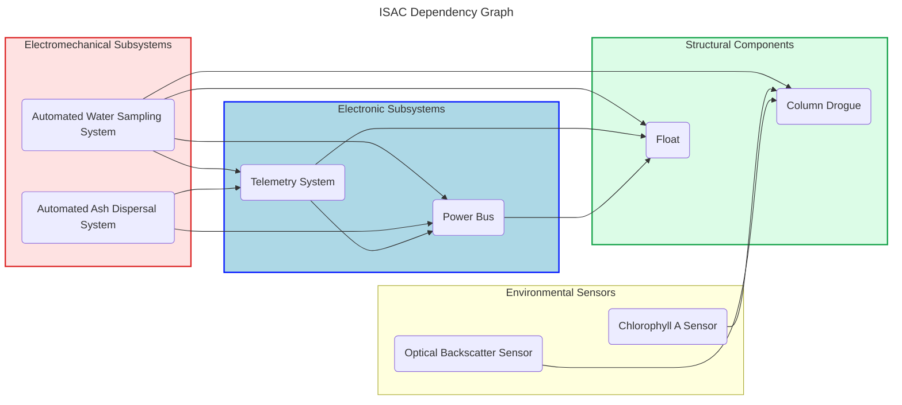

```mermaid
---
title: ISAC Dependency Graph
---

flowchart LR
    %% Sensors grouped at the bottom, pointing up to the Drogue
    subgraph Sensors [Environmental Sensors]
        G(Optical Backscatter Sensor)
        H(Chlorophyll A Sensor)
    end

    %% Core Components
    subgraph Structural [Structural Components]
        A(Column Drogue)
        B(Float)
    end

    subgraph Electronic [Electronic Subsystems]
        C(Power Bus)
        D(Telemetry System)
    end

    subgraph Electromechanical [Electromechanical Subsystems]
        E(Automated Water Sampling System)
        F(Automated Ash Dispersal System)
    end

    %% System Hierarchy and Flow
    %% B-->A
    E -->A
    E --> C
    E --> D
    E --> B

    F --> C
    F --> D

    D --> C
    D --> B
    C --> B

    %% Connecting Sensors to Drogue
    H --> A
    G --> A

    %% %% Invisible structural links to keep layout clean and prevent overlap
    B ~~~ A
    G ~~~ Sensors
    style Structural fill:#dcfce7,stroke:#16a34a,stroke-width:2px
    style Electromechanical fill:#fee2e2,stroke:#dc2626,stroke-width:2px
    style Electronic fill:#ADD8E6,stroke:#0116ff,stroke-width:2px
    %% style Sensors fill:#FFFFED,stroke:#dc2676,stroke-width:2px
```
