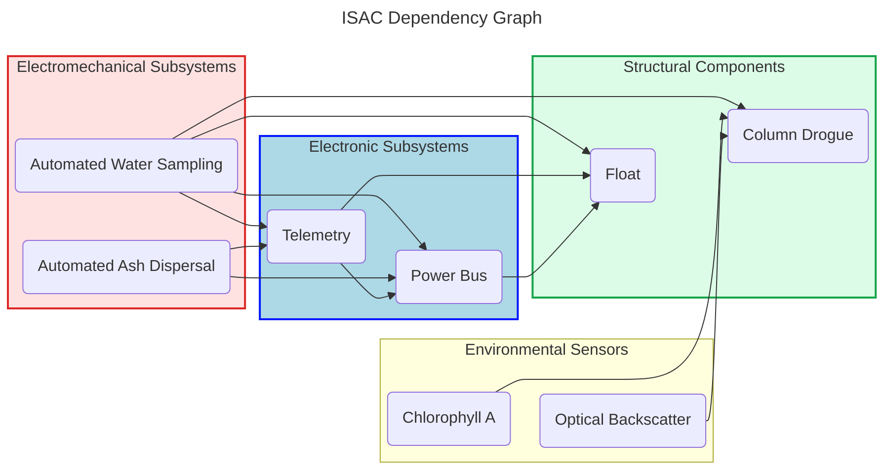

The In-Situ Autonomous Column (ISAC) is a low-cost drifter and sensor platform designed to characterize sinking particles in the surface of aquatic environments. 

**ISAC is currently under development.** For a list of deployments to date, see the "Data" page in the menu above.

## About ISAC

The In Situ Autonomous Column (ISAC) is a low-cost system designed to observe sinking ash in seawater. The movement of particulate matter in aquatic ecosystems is intimately tied to the global cycling of carbon and nutrients, and to ecosystem productivity. The fate of particulate matter in the surface (e.g., phytoplankton, ash) is controlled by how quickly it sinks, yet the behavior of these particles is not well-understood, as it is difficult to measure in a natural environment and not possible to reproduce in a lab.  ISAC offers an inexpensive platform for investigating fundamental science questions of particle dynamics and biogeochemical processes under natural oceanographic conditions. 

An initial ISAC prototype was successfully built and deployed in the Western Tropical South Pacific (WTSP) in March 2026. This prototype consists of a nylon column drogue five meters in length, suspended between a float at the top and a weight at the bottom. The column is hand-deployable, has a low above water profile, and drifts with the water parcel. The length of the column is equipped with vertically distributed Optical Backscatter Sensors (OBS) which monitor sinking particulate matter by logging time series of seawater turbidity over the course of deployment. Ash or other particulate material is deposited manually at the top of the column and observed by the sensors as it settles over the course of 24 hours or more. At the end of the deployment, water samples are pumped from the bottom of the column and the column and sensors are recovered. Initial experiments demonstrated ISAC’s ability to sense ambient and experimental particle fields. Crucially, its ability to sample for trace metal nutrients without contamination was [verified on discrete seawater samples](https://doi.org/10.5281/zenodo.21253933). 

ISAC is also adaptable to a range of other science questions in both lake and marine environments, and closes gaps in the observational system. Moored instrumentation requires routine maintenance and lacks the ability to track moving parcels of water. Uncrewed vehicles require a pilot and shipboard support and skill for deployment and operation. As a water-following device, ISAC is intended to be used where measurements are required to resolve the spatial and temporal evolution of particles and water masses. Proximal to both the ocean and lakes, wildfires are becoming frequent and their impacts on aquatic ecosystems have been understudied. Harmful algae blooms (HABS), which present a challenge for coastal resilience and protection of fisheries, result from an unknown causal chain in changing water chemistry. In response to natural or anthropogenic disturbance events such as volcanic eruptions, wildfires, and HABs, ISAC is an ideal deployable instrument type for mission-oriented experiments and water monitoring. Understanding the fate of particulate matter and its impact on the ecosystem will inform both basic science and the needs of monitoring research and regulatory programs. 

## Planned Improvements
We are in the process of improving ISAC’s technology readiness level in four domains: structural components, including the drogue column and float; electronic components, including power and telemetry; electromechanical components, including automated ash dispersal and water sampling; and optical sensors, including particle backscatter and chlorophyll-a fluorescence. Since ISAC is a modular system, not every column needs to be equipped with all components; a subset may be selected depending on the science question being addressed. We envision a fully equipped column which will be capable of transmitting position and sensor data in real time, as well as automatically handling the mechanical tasks of water sampling and scattering particulate matter at the top of the column.  

The subsystems we plan to develop are shown in the dependency chart below. 

