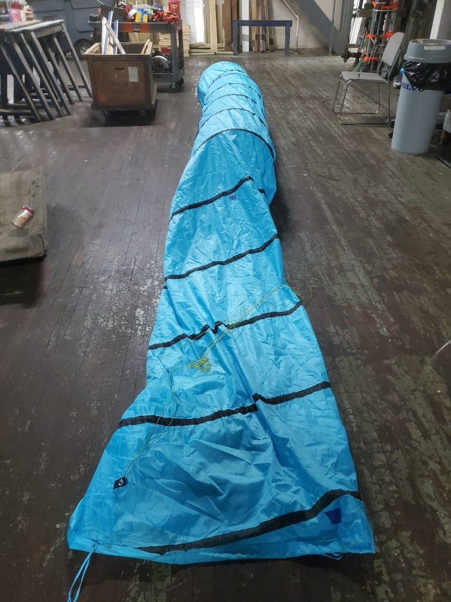
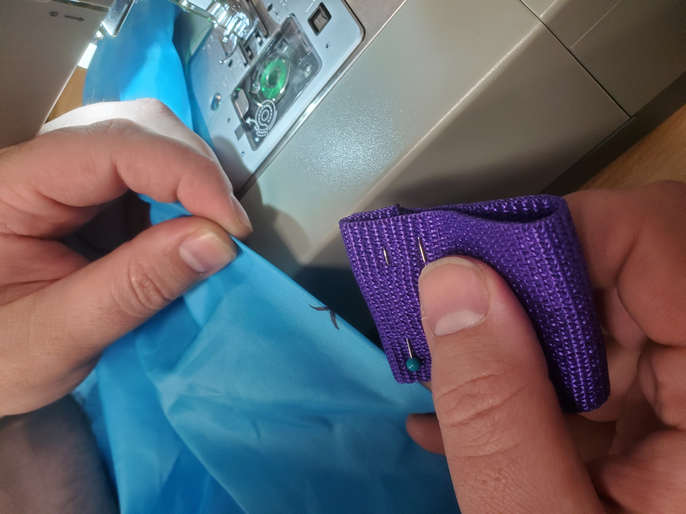
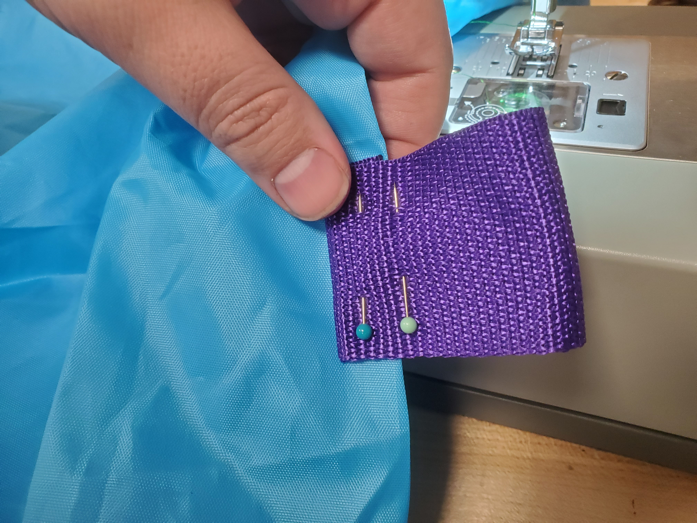
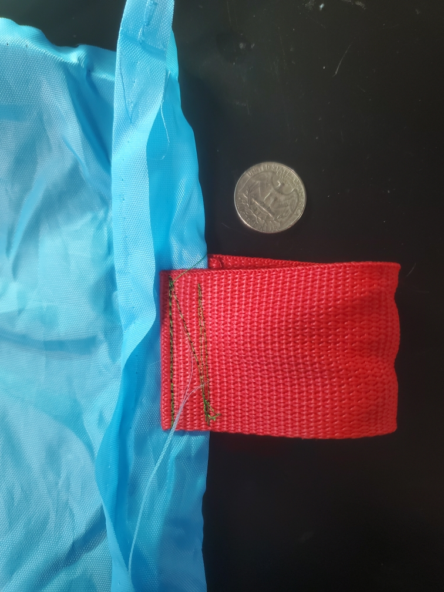
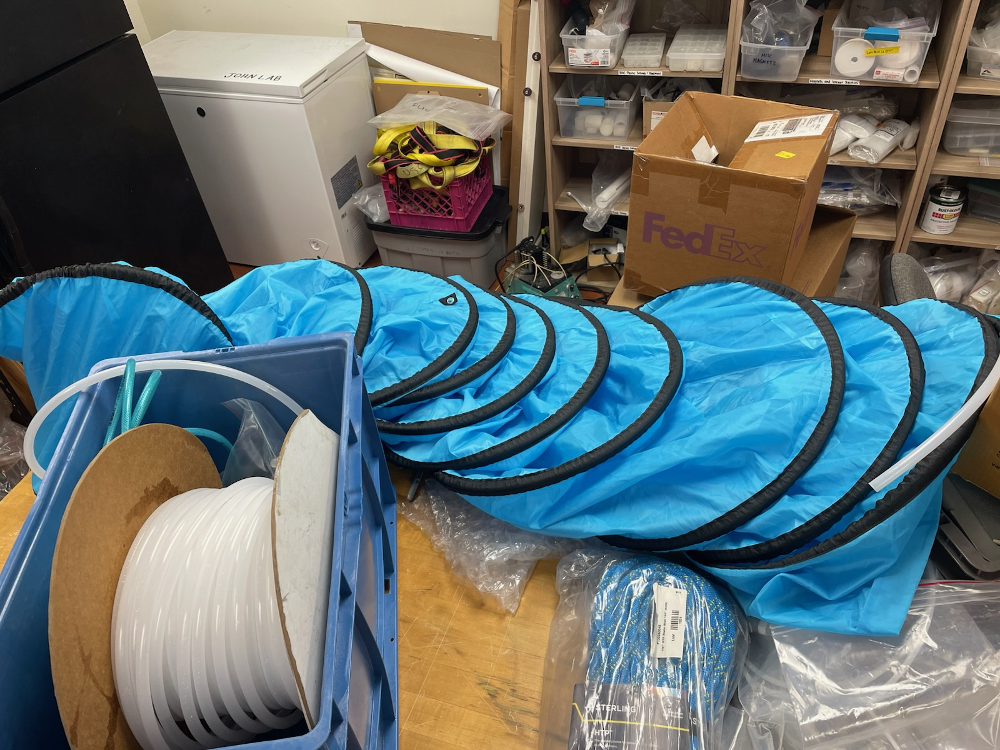

## Introduction
{:.no_toc}
This guide covers build steps for component parts

## Table of Contents 
{:.no_toc}
* TOC
{:toc}

## Drogue Assembly

### Prepare Tunnel
* **Remove springs:** The dog agility tunnel is held up by metal springs. To remove these, cut the seam at the end and feed the spring out. (There are generally two springs held together with a plastic clip in the middle.) This operation is best accomplished with two people. **Wear safety glasses** and be mindful of stored energy in the springs.

* **Remove grommets:** There are also nylon webbing pieces with metal grommets, which have to be removed since the system is measuring trace metals. Cut these webbing pieces off and singe the ends to 

### Sew tunnel webbing
Nylon webbing loops are assembled as shown below. To prepare a loop, cut 5-7 inches of nylon webbing and singe the edges with a lighter to prevent fraying. Fold and pin both ends of the webbing as shown, with the two pins pointing in the same direction. Fold in half and add a third pin between the two layers, above the fold. The loop can then be sewn to the tunnel using polyester thread.

Color-coding the loops is advised.

Once the loops are added, the drogue can be folded up and placed back in the bag that comes with it. Flag-folding works well.

<!-- ### Rigging (lines, sensors w/ crossref to sensor subsection, spinning - ref 3d printed swivel block), tubing}  -->

### Tubing
1/2 inch HDPE tubing is threaded through the sleeve that formerly contained the spring.

## Sensors
### OpenOBS-328 Assembly
See the [OpenOBS-328 documentation page](https://tedlanghorst.github.io/OpenOBS-328/) for general information on constructing the OpenOBS-328 units.

* **Color-coding:** The logger boards are serialized, with 3-digit serial numbers encoded in EEPROM and physically written on the boards. To make the sensors easy to identify just by looking at the housing, we used colored electrical tape and encoded these serial numbers using the [5-band resistor color code,](https://neurophysics.ucsd.edu/courses/physics_120/resistorcharts.pdf), with the tolerance band used to denote different 

* **Modified endcaps:** The endcaps in the original design use automotive plugs. An alterative approach is to replace these with threaded inserts, which are tightened using a strap wrench.
