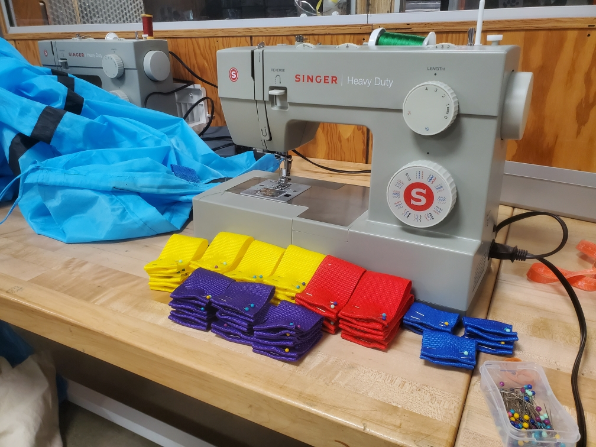
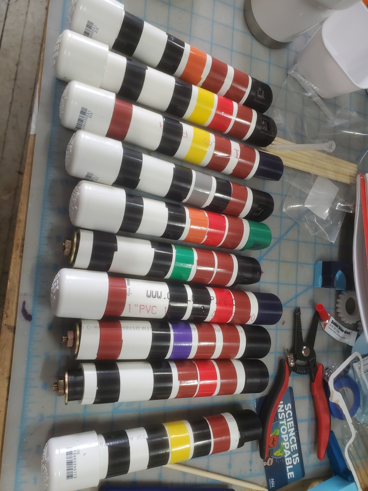

## Introduction
{:.no_toc}
This guide covers build steps for component parts

## Table of Contents 
{:.no_toc}
* TOC
{:toc}

## Drogue Assembly

### Prepare Tunnel
As the basis for our drogue, we used a [dog agility tunnel](https://www.amazon.com/HDP-Agility-Training-Open-Tunnel/dp/B0046HWA4W) made of nylon, about 5m (16.4') in length and 1.83m (72") in circumference. 

* **Keep the tunnel clean:** As you work, make sure to keep the tunnel off the floor, free of paint, dirt and metal particles. If possible, do these steps in an area with large layout/sewing tables that are relatively clean. 

* **Remove springs:** The dog agility tunnel is held up by metal springs. To remove these, cut the seam at the end and feed the spring out. (There are generally two springs held together with a plastic clip in the middle.) This operation is best accomplished with two people. **Wear safety glasses** and be mindful of stored energy in the springs.

_(**Note:** The floor in this image is **way** too dirty to keep the drogue trace metal clean. This photo is from an early prototyping phase.)_ 

* **Remove grommets:** There are also nylon webbing pieces with metal grommets, which have to be removed since the system is measuring trace metals. Cut these webbing pieces off and singe the ends to prevent fraying.

### Sew tunnel webbing
Nylon webbing loops are assembled as shown below. To prepare a loop, cut 5-7 inches of nylon webbing and singe the edges with a lighter to prevent fraying. Fold and pin both ends of the webbing as shown, with the two pins pointing in the same direction. Fold in half and add a third pin between the two layers, above the fold. The loop can then be sewn to the tunnel using polyester thread.

Color-coding the loops is advised. We used blue for the ends, red and yellow for three _hoist lines_ of loops 120 degrees apart along the length of the column to which lines can be secured, and purple for _instrument loops_ inside the column to which instrument lines are secured. (They won't be quite even because of manufacturing variation and the positioning of the channel, but that's okay.) The loops on the ends should be sewn perpendicular to the rim of the drogue, so that multiple columns can be zip-tied together. 

Once the loops are prepared, mark the locations you want to sew them on with a Sharpie. You want the spacing of the loops to be fairly even, but make sure that you aren't interfering with the channel that was used for the spring (which we will use for tubing).  Sew the loops to the column on a pinch, as shown here.  

Once the loops are added, the drogue can be folded up and placed back in the bag that comes with it. Flag-folding works well.

<!-- ### Rigging (lines, sensors w/ crossref to sensor subsection, spinning - ref 3d printed swivel block), tubing}  -->

### Tubing
1/2 inch HDPE tubing is threaded through the sleeve that formerly contained the spring.

## Sensors
### OpenOBS-328 Assembly
See the [OpenOBS-328 documentation page](https://tedlanghorst.github.io/OpenOBS-328/) for general information on constructing the OpenOBS-328 units. Adjustments and notes are discussed below.

* **Color-coding:** The logger boards are serialized, with 3-digit serial numbers encoded in EEPROM and physically written on the boards. To make the sensors easy to identify just by looking at the housing, we used colored electrical tape and encoded these serial numbers using the [5-band resistor color code,](https://neurophysics.ucsd.edu/courses/physics_120/resistorcharts.pdf), with the tolerance band used to denote different sensor types (VCNL4010 vs VCNL4040, e.g.).

* **Modified endcaps:** The endcaps in the original design use automotive plugs. An alterative approach is to replace these with threaded inserts, which are tightened using a strap wrench.
