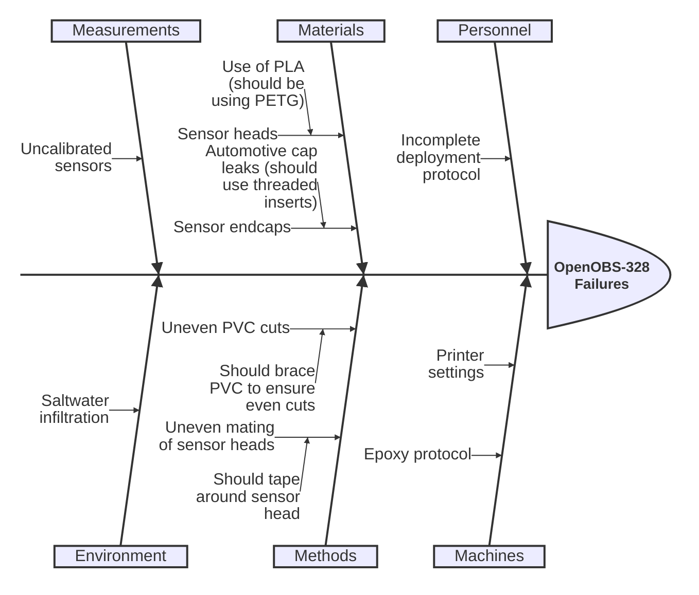

This page concerns quality, calibration and test procedures for subsystems. 
*Like ISAC, this page is a work in progress.*

## OpenOBS Sensors
### QA/QC
Some of the quality issues we encountered with the OpenOBS sensors on our first deployment are reflected in the Ishikawa diagram below. 

