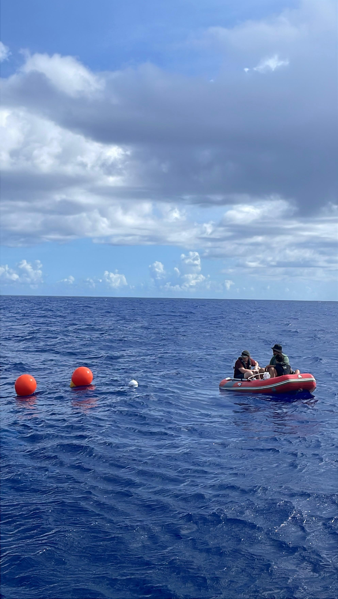

## Introduction
{:.no_toc}

This page contains deployment protocols. 

*Like ISAC, this page is a work in progress.*

## Table of Contents 
{:.no_toc}
* TOC
{:toc}

## Sensor Checklist
- [ ] Remove cap with strap wrench
- [ ] Check battery voltage
- [ ] Connect to computer via USB
- [ ] Program OpenOBS.ino
- [ ] Replace cap, tighten with strap wrench
- [ ] Record sensor ID. column placement, and time

## Drogue Deployment Protocol
### Deployment
Fllowing a recently “pinged” location (lat/lon) of the ISAC instrumentation, the drifter is hand-deployed over the side of the vessel at a nominal 1 knot speed forward. The float is deployed first and using the slow drift forward and drag on the float, the column is extended at the surface and finally, the weight is dropped into the water, which sinks and orients the column vertically.
The position of the device is nominally tracked every 15 minutes over the entire deployment period (up to 24 hrs). 

### Water Sampling
Water sampling is conducted with a diaphragm pump.

### Recovery
Upon recovery, the vessel must use a grappling hook attached to a line to grab the float and pull it up onto the boat, careful to keep the drifter components away from the side of the vessel. 

---
