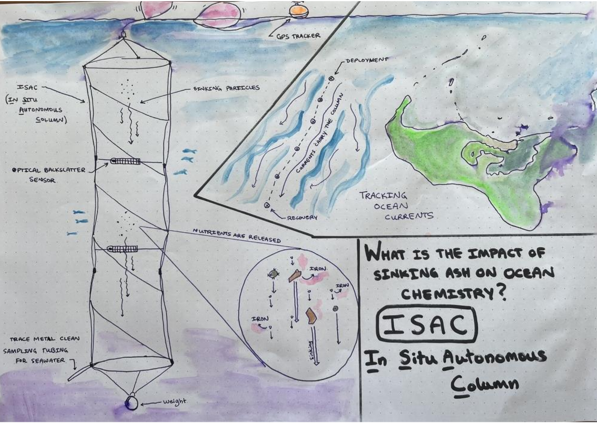

---
# Feel free to add content and custom Front Matter to this file.
# To modify the layout, see https://jekyllrb.com/docs/themes/#overriding-theme-defaults

layout: home
permalink: 
---

Welcome to the ISAC documentation site! Browse the pages linked in the header for information about the project, how to build your own, and where we have deployed and tested our prototypes to date.

If you find an error or have a problem with any part of the project, please let us know by [**opening a new issue**](https://github.com/kcollins/ISAC/issues/new). This leaves a public record of outstanding issues and solutions that can help others. 

---
&nbsp; 

<!-- OpenOBS is published under the [GNU GPL v3 license](https://www.gnu.org/licenses/gpl-3.0.en.html). In short, this license ensures the freedom of use and distribution of this project forever. You can copy this work exactly or modify it (maybe replace the image of my dog with yours), give it away or sell it; what you cannot do is redistribute the OpenOBS, or a derivative of it, without these same freedoms. -->

<!--https://docs.github.com/en/pages/setting-up-a-github-pages-site-with-jekyll/testing-your-github-pages-site-locally-with-jekyll-->
