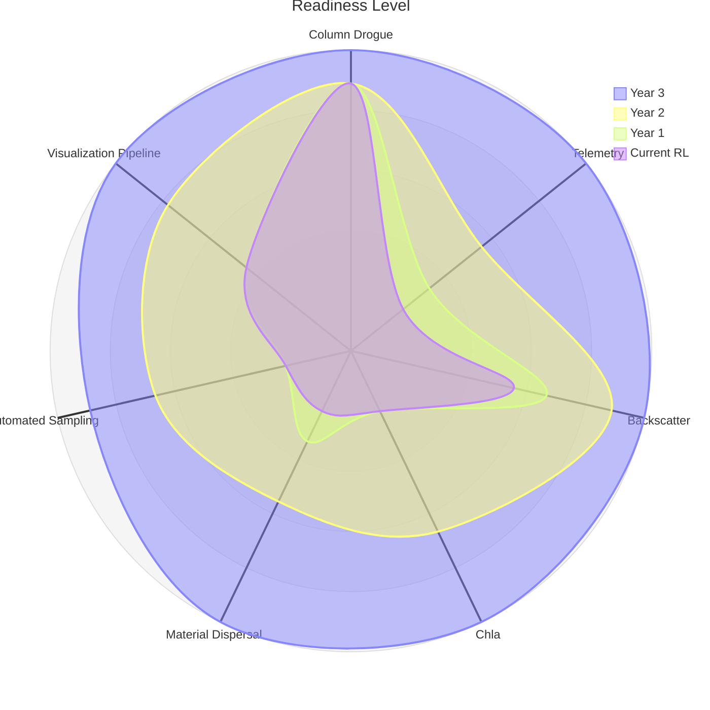

```mermaid
---
title: "Readiness Level"
---
radar-beta
  axis col["Column Drogue"], t["Telemetry"], b["Backscatter"]
  axis c["Chla"], a["Material Dispersal"], s["Automated Sampling"]
  axis v["Visualization Pipeline"]
  curve y3["Year 3"]{9, 9, 9, 9, 9, 8, 9}
  curve y2["Year 2"]{8, 5, 8, 6, 5, 6,7}
  curve y1["Year 1"]{8, 3, 6, 2, 3, 2,4}
  curve y0["Current RL"]{8, 2, 5, 2, 2, 2,4}

  max 9
  min 0
```
